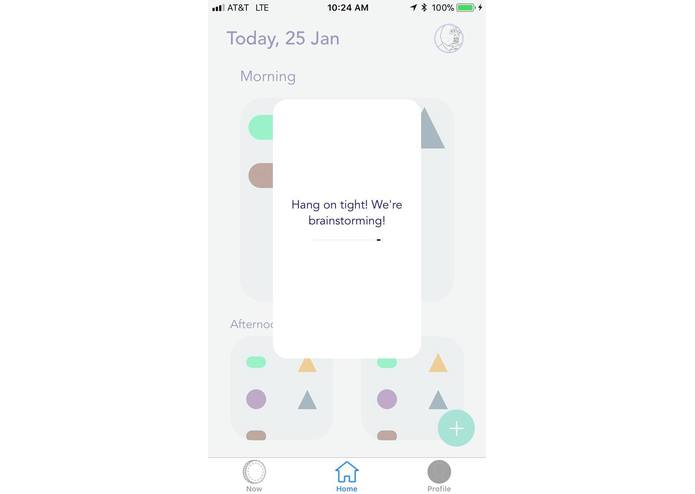

# EatUrPills

This project was created in HackIllinois 2018.

## Inspiration
As people age, our memory starts to wane. In the case of healthcare, it is difficult for the elderly to remember to take their pills. About 20% of people undergoing medication are people aged 40 and above, being forgetful about medication thus have far-ranging consequences. We are avid users of our mobile Calendars today, it would be nice to see our calendar being updated without the need of manual input. In an effort to surmount this, we wanted to create an app that updates your Calendar immediately with a single click!

* An overview of the storyboard of the app

## What it does
It's super easy. Just snap a picture of a prescription label at the moment of purchase and you're Calendar will be automatically updated with the necessary reminders! Our app automatically analyzes the picture, parsing detailed information such as duration of intake, time (e.g morning, noon, night, before and after meal) and description of the pill all on its own!

* An overview of user's of pill intakes

* An overview of user's of pill intakes based on current time period

## How we built it
We mainly used Xcode and Swift language as the entire front-end of the app. The main technology we needed to revolve our app around are OCR(Optical Character Recognition) in detecting text from images and NLP(Natural Language Processing) to identify keywords from the processed images. We researched on the open source projects in the two fields and decides to go with Microsoft Computer Vision API for OCR and spacy.io, an open source NLP project for easy usage. In addition to that, we just need to use iOS/android personal calendar API to update the events and reminder needed.

For the backend, our algorithm mostly run in Python, with the help of simple server communication to the front-end application and google firebase in image storage.

## Challenges we ran into
Initially, we intended to use React Native develop our app. However, due to inconsistencies within the framework, we encountered many difficulties when developing the app. To surmount that, we decided to use swift code instead.

Additionally, we have an inadequate data set that does not allow us to analyze medical keywords with high accuracy. One possible solution is to request for medical data sets from health companies or hospitals to improve the performance of our apps.

## Accomplishments that we're proud of
Our app can successfully take a picture of a prescription label and set reminders for someone's iOS Calendar based on the intake frequency specified. We are happy to see that Microsoft's Computer Vision API is accurate at detecting text from an image while spacy.io's Natural Language Processing API is identifying keywords.

Our goal is to learn how to train and use intelligent APIs such as OCR and NLP while learning how to deploy a full stack app development. We are also very grateful to have a fully cooperative team that cultivates an environment of understanding, discipline and most importantly, fun!

## What we learned
We learned to implement APIs such as Microsoft's Computer Vision and Natural Language Processing from spacy.io. We also had the opportunity to develop our coding skills in Swift.

We learn how to use Firebase and also Python backend server coding as well.

## What's next for Pills
We could target into wider range of audience for people that are undergoing supplements intake such as Vitamin C, Calcium etc. In addition, we could market the product to hospitals, doctors and physicians to help better monitoring our their patient medication dosage. Personal physicians would be able to monitor the frequency of their patient medication and access to their historical data as well in order to prescribe more accurately based on that information.
